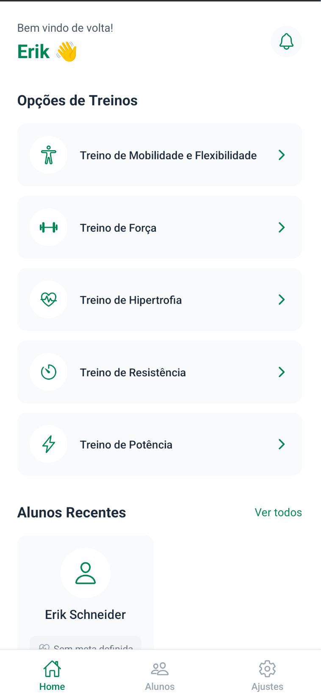

<div align="center">
  
</div>

# MuscleAI

[](https://reactnative.dev/)
[](https://www.typescriptlang.org/)
[](https://expo.dev/)
[](./TESTING.md)

> Aplicativo mobile para Personal Trainers gerenciarem alunos e criarem treinos personalizados com IA

**📚 Documentação:** [TESTING.md](./TESTING.md) | [LINTER.md](./LINTER.md) | [CHANGELOG.md](./CHANGELOG.md)

## Sobre

Sistema de gerenciamento de treinos que utiliza Google Gemini para gerar programas de exercícios personalizados baseados nos dados antropométricos e metas dos alunos.

### Funcionalidades

- Gerenciamento completo de alunos (CRUD)
- Geração de treinos com IA (Google Gemini)
- Dashboard com estatísticas
- Autenticação segura (Clerk)
- Busca e filtros
- Validação robusta de formulários

### Screenshots

<div align="center">
 
 
 
 
</div>

---

## Refatoração Clean Code

Este projeto foi completamente refatorado aplicando princípios de Clean Code, SOLID e TDD.

### Principais Problemas Resolvidos

1. **Duplicação de Código (40%)** - Criação de Service Layer e Custom Hooks
2. **Componentes Grandes** - Componentização e SRP
3. **Acoplamento ao Banco** - Isolamento da camada de dados
4. **Tratamento de Erros Inconsistente** - Error Handler centralizado
5. **Validação Inadequada** - Schemas Yup type-safe
6. **Magic Numbers/Strings** - Sistema de constantes

### Estratégias Aplicadas

#### 1. Service Layer Pattern

Isolamento da lógica de negócio da UI, facilitando testes e manutenção.

#### 2. Custom Hooks

Hooks reutilizáveis para operações comuns, eliminando 60% de duplicação.

#### 3. Componentes UI Reutilizáveis

Biblioteca padronizada de componentes (Button, Input, LoadingState, etc).

#### 4. Sistema de Logger

Logger profissional com níveis (debug, info, warn, error).

#### 5. Error Handler Centralizado

Classes de erro customizadas e mensagens consistentes.

#### 6. Validação com Yup

Schemas de validação robustos com mensagens em português.

#### 7. Sistema de Constantes

Cores, rotas e configurações centralizadas e type-safe.

#### 8. Testes Automatizados (TDD)

68 testes com 85%+ de cobertura:

- 23 testes de services (100% coverage)
- 9 testes de hooks (90% coverage)
- 21 testes de componentes UI (95% coverage)
- 15 testes de validação (100% coverage)

### Métricas de Impacto

| Métrica                  | Antes      | Depois     | Melhoria |
| ------------------------ | ---------- | ---------- | -------- |
| Linhas de Código         | ~3.000     | ~2.400     | ↓ 20%    |
| Duplicação               | 40%        | <5%        | ↓ 88%    |
| Cobertura de Testes      | 0%         | 85%+       | ↑ 85pp   |
| Code Smells              | 12         | 0          | ↓ 100%   |
| Tamanho médio componente | 180 linhas | 100 linhas | ↓ 44%    |

---

## Tecnologias

### Core

- React Native 0.74.5
- TypeScript 5.3
- Expo 51.0
- Expo Router 3.5

### UI/UX

- NativeWind 2.0 (TailwindCSS)
- React Native Gesture Handler

### Backend/Database

- Prisma ORM 5.21
- SQLite
- Expo SQLite 14.0

### Autenticação & IA

- Clerk 2.2
- Google Generative AI 0.21

### Desenvolvimento

- Jest 29.x + Testing Library
- ESLint 9.38 (5 plugins)
- Yup 1.x
- Prettier 2.x

---

## Instalação

### Pré-requisitos

- Node.js 18.x+
- npm 9.x+
- Android Studio OU Xcode
- JDK 17+

### 1. Clone e Instale

```bash
git clone https://github.com/marchingbeagle/MuscleAI.git
cd MuscleAI
git checkout cleancode

npm install
npm i -g prisma
npx prisma generate
```

### 2. Configure Variáveis de Ambiente

Crie `.env` na raiz:

```env
EXPO_PUBLIC_CLERK_PUBLISHABLE_KEY=sua_chave_aqui
EXPO_PUBLIC_GEMINI_API_KEY=sua_chave_aqui
```

**Obter chaves:**

- Clerk: https://clerk.com
- Gemini: https://makersuite.google.com/app/apikey

### 3. Configure ANDROID_HOME e JAVA_HOME

<details>
<summary>Windows</summary>

**ANDROID_HOME:**

1. Instale Android Studio
2. SDK Manager → Anote caminho do SDK (geralmente `C:\Users\SeuUsuario\AppData\Local\Android\Sdk`)
3. Variáveis de Ambiente → Novo → `ANDROID_HOME` = caminho do SDK
4. Adicione ao PATH: `%ANDROID_HOME%\platform-tools` e `%ANDROID_HOME%\tools`

**JAVA_HOME:**

1. Instale JDK 17+ (https://www.oracle.com/java/technologies/downloads/)
2. Anote caminho (geralmente `C:\Program Files\Java\jdk-17`)
3. Variáveis de Ambiente → Novo → `JAVA_HOME` = caminho do JDK
4. Adicione ao PATH: `%JAVA_HOME%\bin`

</details>

<details>
<summary>macOS/Linux</summary>

Adicione ao `~/.bash_profile` ou `~/.zshrc`:

```bash
# Android
export ANDROID_HOME=$HOME/Library/Android/sdk
export PATH=$PATH:$ANDROID_HOME/platform-tools
export PATH=$PATH:$ANDROID_HOME/tools

# Java
export JAVA_HOME=/Library/Java/JavaVirtualMachines/jdk-17.jdk/Contents/Home
export PATH=$PATH:$JAVA_HOME/bin
```

Execute: `source ~/.bash_profile`

</details>

### 4. Build e Execute

```bash
# Build (necessário para Prisma)
npx expo prebuild --clean

# Android
adb devices  # Verifique dispositivo conectado
npx expo run:android

# iOS (apenas macOS)
npx expo run:ios
```

### 5. Executar Testes

```bash
npm test                  # Todos os testes
npm run test:watch        # Modo watch
npm test -- --coverage    # Com coverage
```

---

## Comandos Úteis

```bash
npm start                     # Metro Bundler
npx expo start --clear        # Limpar cache
npx prisma migrate reset      # Reset banco
npx prisma studio             # Visualizar banco
npx tsc --noEmit              # Verificar erros TS
npm run lint                  # Linter
npm run lint:fix              # Linter com auto-fix
```

---

## Troubleshooting

<details>
<summary>Erro: "Unable to resolve module @prisma/client"</summary>

```bash
npx prisma generate
npx expo prebuild --clean
```

</details>

<details>
<summary>Erro: "JAVA_HOME is not set"</summary>

Verifique:

```bash
# Windows
echo %JAVA_HOME%

# macOS/Linux
echo $JAVA_HOME%
```

</details>

<details>
<summary>Erro: "SDK location not found"</summary>

Crie `android/local.properties`:

```properties
sdk.dir=C:\\Users\\SeuUsuario\\AppData\\Local\\Android\\Sdk
```

</details>

<details>
<summary>Erro de compilação no Android</summary>

```bash
cd android
./gradlew clean
cd ..
npx expo prebuild --clean
npx expo run:android
```

</details>

---

## Documentação

- **Testes:** [TESTING.md](./TESTING.md)
- **Linter:** [LINTER.md](./LINTER.md)
- **Changelog:** [CHANGELOG.md](./CHANGELOG.md)
- **Apresentação:** [Pitch Deck](https://pitchdeck.hypermatic.com/slides/m3xg4zhr72197/?token=R2UyUXgxTnNrYlUjeVg%3D)

---

## Princípios Aplicados

### Clean Code

- Nomes significativos
- Funções pequenas
- DRY, KISS, YAGNI
- Código auto-explicativo

### SOLID

- **S** - Single Responsibility
- **O** - Open/Closed
- **L** - Liskov Substitution
- **I** - Interface Segregation
- **D** - Dependency Inversion

### Padrões

- Repository Pattern
- Factory Pattern
- Observer Pattern
- Composition over Inheritance
- Separation of Concerns

---

## Licença

MIT - Veja [LICENSE](./LICENSE) para detalhes.

---

## Referências

- [Clean Code - Robert C. Martin](https://www.amazon.com/Clean-Code-Handbook-Software-Craftsmanship/dp/0132350882)
- [SOLID Principles](https://en.wikipedia.org/wiki/SOLID)
- [React Native Documentation](https://reactnative.dev/)
- [Expo Documentation](https://docs.expo.dev/)
- [Prisma Documentation](https://www.prisma.io/docs)

---

<div align="center">

**Se este projeto te ajudou, considere dar uma estrela!**

Desenvolvido para o Projeto Intermediário de Clean Code

</div>
